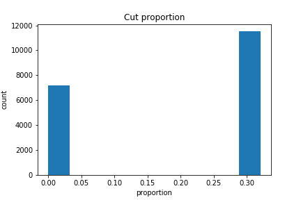

# ds5500hw4
# Problem 1
## For the districts you selected for budget cuts in HW 3 Problem 4, calculate and visualize the proportion of each district’s total funding that will be lost.
  
In HW3 Problem4, I have chosen to cut the budgets proportionally based on their total profit. The cut will only be performed if profit>0.  Hence, this is basically a bar plot that counts the number of schools that have positive profit.
## Which districts will be affected by your budget cuts the most?
The most affected districts are:  

| LEAID |
|-------|
|0622710|
|2680995|
|1500030|
|4218990|
|2400480|

# Problem 2
A common problem with purely data-driven solutions is that they can inadvertently perpetuate hidden pre-existing biases in the data, and further disadvantage groups that are already disadvantaged.  
## Calculate the proportion of enrolled students by race for each district, then visualize the distributions of these for districts that received budget cuts versus districts that did not receive budget cuts.

## Comment on whether the the distributions appear to be the same or different. Did your selection include any hidden biases, or manage to avoid them?
There is a difference in distribution of races between the the districts that are affected by cut and those that are not affected. This is especially notable in Black, Hispanic and White students. In my cut strategy, there is a Black and Hispanic students are less affected by the cut, while white students are more affected. This is probably due to white students are usually in the schools that is has more profit. My selection does include some hidden bias, but this bias is also influenced by the ethnic income inequality in the US.

# Problem 3
## Calculate the proportion of enrolled students by disability status (students with an IEP under IDEA) for each district, then visualize the distributions of these proportions for districts that received budget cuts versus districts that did not receive budget cuts.

## Comment on whether the the distributions appear to be the same or different. Did your selection include any hidden biases, or manage to avoid them?
There is a difference in distribution of students with disability between the the districts that are affected by cut and those that are not affected. My selection might had included some bias that I had overlooked, and it is definitely worthwhile to further look into this problem.

# Problem 4
## Choose and critique one of your fellow classmates’ selection of schools for budget cuts in HW 3 Problem 4 and Problem 5. What was the justification of their selection? Discuss any advantages or disadvantages of their approach.
I choose this answer to critize: <https://nbviewer.jupyter.org/github/kasoju2712/DataViz_Hw3/blob/master/DataViz%20Hw3.ipynb>  
The justification of this solution is to cut the funding proportionally instead of uniformly based on the federal revenue they have received. The main advantage of this solution is that, this does lower the influence for the schools that already have relatively fewer federal revenue. But there are many factors that had been overlooked, such as the number of students, education quality, financial difficulties, etc.

# Problem 5
## Summarize and comment on what you learned from one the special topics lectures (MapReduce + Hadoop, Visualization, Causal Inference, or the Industry Panel) of your choice.
I will comment on what I have learned in the industry panel. The panel have invited 4 speakers with a job title of "Data Scientist", but all of them have very different job responsibilities, and very different academic backgrounds. I think there are two major takeaways that I have gotten in this panel. First, your background does not decide whether you will be successful as a Data Scientist or not. Some skills that you have learned in your past experience will make you better at being a data scientist, but there is no a single decisive factor. Second, communication is a extremely important skill. Data scientist exist to resolve real-world problems. You need to be able to communicate with the businuess people to identify the problems they are trying to resolve, and give proper feedback on how you can help them as a data scientist. You also need to be able to communicate with the tech people, so that they can assist you in the technical problems. In general, data scientist is not just a role of engineering, but a generalist that is able to resolve real-world problem using data-drive solution.
